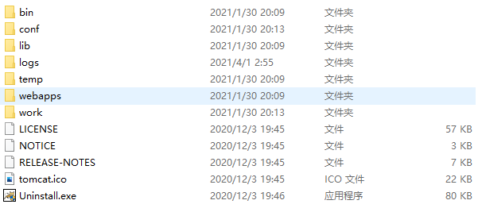

# Tomcat Web服务器软件

[toc]

本次教程是在Windows 10环境下制作的，仅供参考。

## 下载

[Tomcat下载地址](http://tomcat.apache.org/)：`http://tomcat.apache.org/`

## 安装

1. 免安装版可直接解压
2. 安装包双击走流程即可

**注意：安装路径为全英文，防止无法运行**

## 卸载

1. 免安装版可直接删掉文件目录即可
2. 安装包版可进入安装目录双击Uninstall.exe即可，卸载走流程

## 启动

1. 在Tomcat安装目录内，可进入bin目录双击startup.bat文件来启动Tomcat Web服务器
2. 打开浏览器，输入`http://localhost:8080`，回车。如果显示了Tomcat网页，即表示成功运行

**可能遇到的问题**

1. 黑窗口一闪而过
   * 未配置JAVA_HOME，需要在环境变量中配置Java环境
2. 启动报错
   * 查看日志，分析异常信息。如有发现bindException，表示端口号被占用。
     1. 可杀掉占用端口的进程。
     2. 进入conf文件夹中，打开server.xml，修改有关的端口配置信息。（端口：port）

## 关闭

1. 正常关闭：在Tomcat安装目录内，可进入bin目录双击shutdown.bat文件来关闭Tomcat Web服务器
2. 强制关闭：直接关掉

## 配置

* 部署项目的方式：

  1. 直接将项目放入webapps目录下即可。

     简化部署方式（**常用**）:将项目打包成war包，直接放入该目录即可。

  2. （**仅限单个项目**）配置conf/server.xml，在最外层标签内添加一个单标签，格式如下：

     `<Context docBase="D:\webapps" path="/hello" />`

     docBase: 项目存放路径

     path: 虚拟目录

  3. （**极力推荐、热部署**）在conf\Catalina\localhost目录中新建个任意名称的.xml文件文件中编写以下代码：

     `<Context docBase="D:\webapps" />`

     此时，虚拟路径即为.xml文件的名称。

* 静态项目与动态项目

  * 目录结构

    * javaWeb动态项目的目录结构：

      --- 项目根目录

      ​		--- WEB-INF目录

      ​				--- web.xml: web项目的核心配置文件

      ​				--- classes目录: 放置字节码文件的目录

      ​				--- lib目录: 放置依赖的Jar包

## 额外内容

### Tomcat目录结构

| 文件夹名称 | 存放文件作用              |
| ---------- | ------------------------- |
| bin        | 可执行文件                |
| conf       | 配置文件                  |
| lib        | 依赖Jar包                 |
| logs       | 日志文件                  |
| temp       | 临时文件                  |
| webapps    | web项目存储位置           |
| works      | 运行时的数据 runtime data |

