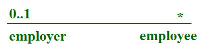

# UML—— 统一建模语言

[toc]

## 0 概述

### 0.0 什么是UML

* UML 是 OMG 在1997年1月提出了创建由对象管理组和 UML1.0 规范草案；
* UML 是一种为面向对象开发系统的产品进行说明、可视化、和编制文档的标准语言；
* UML 作为一种模型语言，它使开发人员专注于建立产品的模型和结构，而不是选用什么程序语言和算法实现；
* UML 是不同于其他常见的编程语言，如 C + +，Java中，COBOL 等，它是一种绘画语言，用来做软件蓝图；
* UML 不是一种编程语言，但工具可用于生成各种语言的代码中使用 UML 图；
* UML 可以用来建模非软件系统的处理流程，以及像在一个制造单元等.

### 0.1 UML概念模型

概念模型可以被定义为模型，它是由概念和它们之间的关系组成的。

概念模型是在绘制 UML 图之前，它帮助了解在现实世界中的各个实体，以及他们如何互相交流。

**概念模型三大要素**

* UML构建模块 --- **模块**
* 规则连接构建模块 --- **规则**
* UML公共机制 --- **公共机制**

### 0.2 UML面向对象

面向对象 (Object Oriented,OO) 是软件开发方法，面向对象的概念和应用已超越了程序设计和软件开发。我们可以将 UML 描述为面向对象的分析和设计的继任者。UML 图是面向对象的概念的表示，因此，学习 UML 之前，详细了解面向对象的概念就变得非常重要。

面向对象的几个基本概念：

* **对象**：对象代表一个实体的基本构建块。
* **类:** 类是对象的蓝图。
* **抽象化:** 抽象代表现实世界中实体的行为。
* **封装:** 封装是将数据绑定在一起，并隐藏他们外部世界的机制。
* **继承:** 继承是从现有的机制作出新的类。
* **多态性:** 定义的机制来以不同的形式存在。

### 0.3 UML基本元素

**事务(4种)**：

0. 结构事务：类、接口、协作、用例、活动类、组件、节点。
1. 行为事务：交互、状态机。
2. 分组事务：包。
3. 注释事务：注释。

**关系(4种)**：

0. 依赖
1. 关联
2. 实现
3. 泛化

**图(10种)**：

0. 用例图
1. 类图
2. 对象图
3. 包图
4. 部署图
5. 活动图
6. 状态图
7. 序列图
8. 协作图
9. 组件图

## 1 构建模块

### 1.0 事务

事物是实体抽象化的最终结果，是 UML 构建块最重要的组成部分。

#### 1.0.0 结构事务

结构事务是模型中的静态部分，用以呈现概念或实体的表现元素，是软件建模中最常见的元素。

0. **类(Class)**：指具有相同属性、方法、关系和语义的对象的**集合**。

   

1. **接口(Interface)**：指类或组件所提供的服务(操作)，**描述**了类或组件对外可见的**动作**。

   

2. **协作(Collaboration)**：协作**定义了**元素之间的**相互作用**。

   

3. **用例(Use-Case)**：用例**定义了**执行者(在系统外部和系统交互的人)和被考虑的系统之间的**交互**来实现的一个业务目标。

   

4. **组件(Component)**：**描述物理系统**的一部分。

   

5. **节点(Node)**：可以被定义为在**运行时存在的物理元素**。

6. 

#### 1.0.1 行为事务

行为事务指UML模型中的动态部分，表示模型中随时空不断变换的部分。

0. **交互(Interaction)**：交互被定义为一种行为，包括一组元素之间的消息交换来完成特定的任务。

   

1. **状态机(State)**：由一系列对象的状态组成。(它是有用的，一个对象在其生命周期的状态是很重要的)

   

#### 1.0.2 分组事务

可以把分组事务看作一个“盒子”，模型可以在其中被分解。

0. **包(Package)**：封装是唯一一个分组事务可收集结构和行为的东西。包纯粹是概念上的，只存在于开发阶段。

#### 1.0.3 注释事务

注释事务可以被定义为一种机制来捕捉UML模型元素的言论、说明和注释。

0. **注释(Note)**：注释用于渲染意见、约束等UML元素。

### 1.1 关系

关系是另一个最重要的构建块UML，它显示元素是如何彼此相关联，此关联描述了一个应用程序的功能。

* **依赖关系(Dependency)**：依赖是两件事物之间的的语义联系，其中一个事物的变化也影响到另一个事物。

  

* **协作关系(Association)**：也可称为关联关系。一种描述一组对象之间连接的结构关系，如聚合关系(描述了整体和部分间的结构关系)。

* **泛化关系(Generalization)**：泛化可以被定义为一个专门的元件与一个广义元素的连接关系，它基本描述了在对象世界中的继承关系，是一种**一般化 --- 特殊化**的的关系。

* **实现关系(Realization)**：类之间的语义关系，其中一个类指定了由另一个类保证执行的契约。

### 1.2 UML图

完整的UML图表现了一个系统的所有元素及其关系。其视觉效果是整个过程中最重要的部分。

图是事物集合的分类，UML中包含了多种图：

0. **类图**：类图描述了系统所包含的类、类的内部结构及类之间的关系。
1. **对象图**：对象图是类图的一个具体实例。
2. **用例图**：用例图从用户的角度出发描述系统的功能、需求，展示系统外部的各类角色与系统内部的各种用例之间的关系。
3. **顺序图**：顺序图表示对象之间动态合作的关系。
4. **协作图**：协作图描述对象之间的协作关系。
5. **活动图**：活动图描述系统中各种活动的执行顺序。
6. **状态图**：状态图描述一类对象的所有可能的状态以及事件发生时状态的转移条件。
7. **部署关系图**：部署关系图定义了系统中软硬件的物理体系结构。
8. **组件图**：组件图描述了代码部件的物理结构以及各部件之间的依赖关系。

## 2 UML架构

UML由视图(View)、图(Diagrams)、模型元素(Model elements)和通用机制等几个部分构成。

### 2.0 架构组成部分

* **视图**：用来表示被建模系统的各个方面。由多个图构成，它不是一个图片，而是在某一个抽象层上，对系统的抽象表示。如果要为系统建立一个完整的模型图，只需要定义一定量的视图每个视图表示系统的一个特殊方面就可以了。视图还把建模语言和系统开发时选择的方法或过程连接起来。
* **图**：由各种图片组成用来描述一个视图的内容。
* **模型元素**：代表面向对象中的类、对象、消息和关系等概念，是构成图的最基本的常用概念。
* **通用机制**：用于表示信息，如注释、模型元素的语义等。它还提供拓展机制，使UML语言能够适应一种特殊的方法(或过程)、或扩充至一个组织或用户。

### 2.1 不同角度定义UML系统

UML 系统可以由不同的用户使用，用户可以是开发人员、测试人员、商务人士、分析师等等，所以要设计一个系统的体系结构，最重要的是做到从不同的角度来看，实现可视化系统，这样也可以让我们自己更好的了解系统，让它达到一个更好的效果。

从**不同的角度**使用 UML 定义一个系统的起着重要的作用，这些角度分别是设计、实现、处理和部署。

* **设计**：包含类、接口和协作。（类图、对象图）
* **实现**：将定义的组件组装在一起，形成一个完整的系统。（组件图）
* **处理**：定义了系统的流动。（*）
* **部署**：由物理节点的硬件系统构成。（部署图）

## 3 UML建模类型

UML 建模可以把在复杂世界的许多重要的细节给抽象出。为了区分 UML 模型， UML 建模用不同类型的不同的图。

### 3.0 结构建模

结构建模具有捕捉静态的功能，包括类图、对象图、部署图、包图、复合结构图和组件图。

结构模型代表系统架构，即这个框架所有组件存在的地方。因此，类图、对象图、组件图和部署图都是结构建模所要建立的模型。

结构模型无法描述系统的动态行为。

### 3.1行为建模

行为建模描述了系统中的各部分相互作用。行为建模主要为了体现系统的动态性质，包括活动图、交互图和用例图。

### 3.2 架构建模

架构建模表示的是建立一个系统的总体框架，它包含了系统的结构和行为的元素。

架构模型可以定义为整个系统的蓝图。包图是根据架构模型进行的分组事务。

## 4 UML基本表示法

UML使用常见的图解符号，它是可视化的、用来说明、构建和记录软件和非软件系统的一种工程方法。

UML符号是重要的建模元素。这可以极大的方便我们建立软件系统模型。我们要准确的掌握各种符号，因为不同的符号表示不同的含义，失之毫厘，谬以千里。

### 4.0结构事务

图形表示法中使用的结构事物是 UML 中最广泛使用的，这些被认为是为 UML 模型的名词。

#### 4.0.0 类注释

UML类如上图示，该图分为四个部分：

0. 顶端部分为**类名**
1. 第二部分用来显示类的**属性**
2. 第三部分用来描述由类执行的**操作**
3. 第四部分是非强制性的显示附加组件

类是用来表示对象，对象可以是任何性质和职责。

#### 4.0.1 对象表示法

对象和类的表示方式一样，唯一的区别是对象名称下有<u>下划线</u>，如上图所示。如果对象是实际执行的类，即已被创建的类，我们将之称之为实例。

#### 4.0.2 接口表示法

接口用圆来表示，它的名称一般写在圆的下面，如上图所示。接口是仅仅用来描述功能，不实现执行。

#### 4.0.3 协作表示法

协作用椭圆虚线表示，协作的名称写在椭圆内，如上图所示。协作一般由多种职责组成。

#### 4.0.4 用例表示法

用例用椭圆实线表示，其名称写在椭圆内，如上图所示。用例是用来展现系统的高层次功能。

#### 4.0.5 角色表示法

某些内部或外部的与系统进行交互的实体，可以被定义为一种角色。角色是用例图中的内部或外部实体。

#### 4.0.6 初始状态表示法

初始状态符号一般用来显示一个过程的起点。这个符号存在于大多数图。

#### 4.0.7 最终状态表示法

最终状态符号一般用来显示一个过程的终止点。这个符号存在于大多数图。

#### 4.0.8 活动类表示法

活动类一般用来描述一个系统的并发行为。

#### 4.0.9 元件表示法

元件表示UML中的组件，在必要时可以添加额外的元素。元件可以表示系统的任何部分的UML图。

#### 4.0.10 节点表示法

UML中用一个方盒子表示一个节点，如下图所示，一个节点表示一个物理的系统器件。

节点一般用来表示物理系统的一部分，如服务器、网络等。

### 4.1 行为事务

UML有一个强大的功能集，代表软件和非软件系统的动态部分。这些功能包括交互和状态机。

相互作用可以分为两种类型：顺序（序列图）和协作（协作图）。

#### 4.1.0 交互表示法

交互基本上是两个UML组件之间的信息交换，上 

图表示交互中使用不同的符号。

#### 4.1.1 状态机表示法

状态机主要用来描述组件在不同生命周期的不同状态，状态可以是活动、空闲或任何其他。其符号如上图所示。

### 4.2 分组事务

UML中只有一个元件用于分组事务——包。

#### 4.2.0 包表示法

包存储信息的方式如上图所示，这是用来包装系统某个部分的图示。

### 4.3 注释事务

任意图表中，描述不同的元素和不同的功能是非常重要的。

#### 4.3.0 注释表示法

如上图所示，注释用来标注系统的必要信息。

### 4.4 UML关系

只有描述，没有关系的模型是不完整的。UML提供了四种不同的关系：依赖、协作、泛化和拓展。

#### 4.4.0 依赖表示法

依赖是比较常见的关系类型，它描述了元素之间的依赖方向，如图示。

依赖关系用虚线箭头表示，图中表示的就是Dependent依赖于Independent。

#### 4.4.1 协作表示法

协作主要展现有多少个元素参加互动，如上图所示。

协作关系用直线连接表示，这种协作关系主要表示两个元素相互联系。

#### 4.4.2 泛化表示法

泛化关系主要表现面向对象世界的继承关系。如上图所示，实现箭头，箭头为空心三角，由子类对象指向父类对象。

## 5 UML类图

### 5.0 类图概述

类图（Class Diagram）是面向对象系统建模中最常用和最重要的图，是定义其它图的基础。

类图主要是用来显示系统中的类、接口以及它们之间的静态结构和关系的一种静态模型。

类图不仅用于可视化描述和记录系统的不同方面，也为构建可执行代码的软件应用程序。

类图描述一类的属性和操作，也对系统的约束。被广泛应用于类图的建模的面向对象的系统中，因为它们是唯一的，可以直接映射到面向对象的语言的 UML 图。

类图显示集合的类，接口，关联，协作和约束，它也被称为作为结构图。

### 5.1 类图的目的

类图的目的就是构建一个应用程序模型的静态视图。

类图是唯一可以直接映射到面向对象语言的图。因此广泛用于开发阶段。

[toc]

