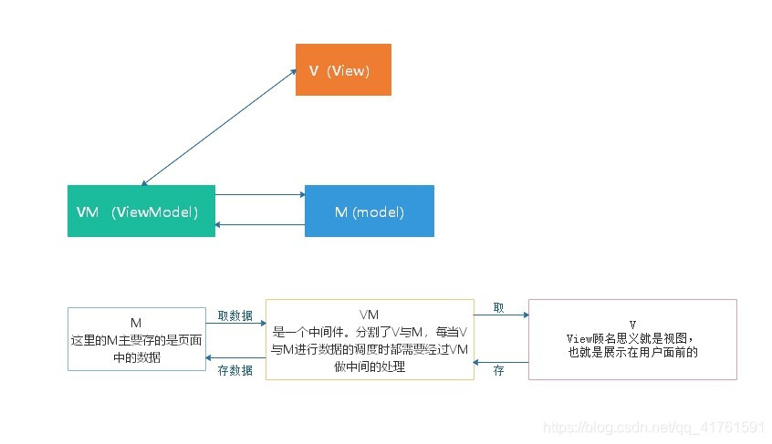

#  前言

[toc]

## 前言

目前，主流前端框架为React、Vue、AngularJS，React的作者是Facebook团队；Vue的作者是中国的尤雨溪；Angular的的作者是Google团队。

在此我们主要介绍Vue.js，其主流版本为2.x和3.x。

* 2.x基本已经十分成熟，目前企业级使用的主流版本。
* 3.x目前正在开发中，目前已经足够使用，即将成为企业级的主流版本。

Vue官网：https://vuejs.org/

中文官网：https://cn.vuejs.org/

插件官网：https://devtools.vuejs.org/

脚手架官网：https://cli.vuejs.org/

## 什么是Vue

Vue (读音 /vjuː/，类似于 **view**) 是一套用于构建用户界面的**渐进式框架**。

与其它大型框架不同的是，Vue 被设计为可以自底向上逐层应用。

Vue 的核心库只关注视图层，不仅易于上手，还便于与第三方库或既有项目整合。

另一方面，当与[现代化的工具链](https://cn.vuejs.org/v2/guide/single-file-components.html)以及各种[支持类库](https://github.com/vuejs/awesome-vue#libraries--plugins)结合使用时，Vue 也完全能够为复杂的单页应用提供驱动。

## MVVM模型

想要了解Vue，那我们必须了解一下MVVM模型。

MVVM 是Model-View-ViewModel 的缩写，它是一种基于前端开发的架构模式，MVVM拆开来即为Model-View-ViewModel，有View，ViewModel，Model三部分组成。View层代表的是视图、模版，负责将数据模型转化为UI展现出来。Model层代表的是模型、数据，可以在Model层中定义数据修改和操作的业务逻辑。ViewModel层连接Model和View。

在MVVM的架构下，View层和Model层并没有直接联系，而是通过ViewModel层进行交互。ViewModel层通过双向数据绑定将View层和Model层连接了起来，使得View层和Model层的同步工作完全是自动的。因此开发者只需关注业务逻辑，无需手动操作DOM，复杂的数据状态维护交给MVVM统一来管理。

## Vue两个特性

### 数据驱动视图

详细说说？

### 双向数据绑定

也行？

