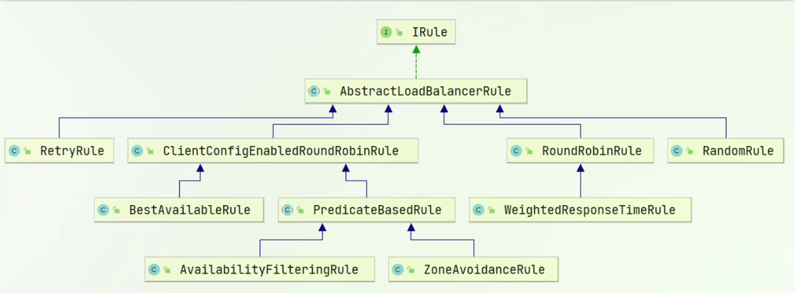

# Spring Cloud Netflix

[toc]


## Eureka

### 原理

对于Eureka来说，整个项目分为两部分，一部分是服务端，一部分是客户端。

服务端即为注册中心。

客户端分为两种类型，一种是服务生产者，一种是服务消费者。

Eureka的执行步骤为：

1. 服务生产者向Eureka注册中心进行注册，注册中心记录服务生产者名称，同一个名称的多个服务视为服务集群。
2. 服务消费者向Eureka注册中心通过生产者名称拉取生产者列表，获得生产者的信息（IP+端口）。
3. 消费者按照负载均衡的配置选出一个生产者。
4. 消费者对生产者进行远程调用。


Eureka检测生产者健康状态：**心跳续约**

生产者每三十秒向注册中心发送一次心跳，告知注册中心存活。


### 注册中心

Eureka注册中心本身也是一个微服务，也可理解为客户端，因此需要将自己注册到注册中心。主要用于Eureka集群间通信。

主要功能：

* 记录服务信息
* 心跳监控

#### 如何搭建

1. 创建项目，引入依赖spring-cloud-starter-netflix-eureka-server

   ```xml
   <dependency>
       <groupId>org.springframework.cloud</groupId>
       <artifactId>spring-cloud-starter-netflix-eureka-server</artifactId>
   </dependency>
   ```

   

2. 编写启动类，添加@EnableEurekaServer注解

3. 添加application.yml，编写如下配置

   ```yaml
   server:
   	port: 12345
   spring:
   	application:
   		name: eureka-server
   eureka:
   	instance:
   		hostname: 127.0.0.1
   	client:
   		service-url:
   			defaultZone: http://${eureka.instance.hostname}:${server.port}/eureka/
   ```

   

### 客户端

主要功能

Provider：

* 向注册中心注册信息
* 向注册中心发送心跳（每30秒）

Consumer：

* 根据服务名称从注册中心获取服务列表
* 基于服务列表做负载均衡，选择后发起远程调用

#### 服务注册

**客户端的生产者和消费者都需要进行服务注册。**

1. 在客户端pom文件中引入依赖spring-cloud-starter-netflix-eureka-client

   ```xml
   <dependency>
       <groupId>org.springframework.cloud</groupId>
       <artifactId>spring-cloud-starter-netflix-eureka-client</artifactId>
   </dependency>
   ```

2. 在application.yml中编写下列配置

   ```yaml
   spring:
   	application:
   		name: SERVICE-NAME	# 服务名称
   eureka:
   	client:
   		service-url:
   			defaultZone: http://127.0.0.1:12345/eureka/
   ```

#### 服务拉取

请求的URL使用的RESTful风格，因此URL可以将IP+port部分更换为eureka服务名称。

在http客户端请求工具restTemplate的Bean上可以添加注解@LoadBalanced进行负载均衡请求。


## Robbin

在Eureka的Consumer对Provider进行远程调用时，会通过Robbin组件进行负载均衡。

### 原理

远程调用过程

1. Consumer远程调用的请求将提交给Robbin组件
2. Robbin组件对该请求进行拦截
3. 通过Eureka注册中心获取Producer列表
4. 根据负载均衡规则选择Producer实例
5. 转换请求URL，并发送

### 负载均衡规则

Robbin使用的负载均衡策略实质上都是实现的IRule接口，如果我们没有配置任何负载均衡策略的话，默认是使用**ZoneAvoidanceRule + RoundRobinRule**这两个策略的。

Robbin提供的几种负载均衡规则，其类图如下图所示：



* RetryRule：重试，先按照轮询策略获取服务，若获取失败，则在指定时间进行重试，重新获取可用服务。
* BestAvailableRule：高可用，先过滤掉不可用服务（多次访问故障而处于断路器跳闸的服务），选择一个并发量最小的服务。
* AvailabilityFilteringRule：可用筛选，先过滤掉不可用服务 以及 并发量超过阈值的服务，对剩余服务按轮询策略访问。
* ZoneAvoidanceRule：区域回避，默认规则，综合判断服务所在区域的性能 以及 服务的可用性，过滤结果后采用轮询的方式选择结果。
* RoundRobinRule：轮询，按照服务列表顺序 循环选择服务。
* WeightedResponseTimeRule：加权响应时间，响应时间越低（即响应时间快），权重越高，越容易被选择。刚开始启动时，使用轮询策略。
* RandomRule：随机，随机的从服务列表中选取服务。 

### 如何配置负载均衡规则

1. 配置IRule实例Bean

   ```java
   @Configuration
   public class CustomizeLoadBalanceRule {
         @Bean
         public IRule customizeRule() {
             return new RandomRule();
         }
   }
   ```

   **注意**：根据官方文档提示，如果只是针对某个服务调用使用自定义的负载均衡策略，在配置时要注意不要配置成全局的Bean，即不要被@ComponentScan 扫描到不能与启动类在同一个包下。

2. 在启动类上添加@RibbonClient注解，并指定服务名以及规则。

   ```java
   @RibbonClient(name = "SERVICE-NAME", configuration = CustomizeLoadBalanceRule.class)
   ```

3. 通过yml配置文件中配置负载均衡实例类名来指定负载均衡策略

   ```yaml
   SERVICE-NAME: # 服务提供者的服务名
     ribbon:
       NFLoadBalancerRuleClassName: com.netflix.loadbalancer.RandomRule # 全限定类名
   ```

### Ribbon加载方式

Ribbon默认是采用懒加载，只有第一次进行远程调用时，才会创建LoadBalanceClient，请求时间会很长。

如果想解决这个问题，我们可以让Ribbon使用饥饿加载（在项目启动时创建Ribbon）的方式运行。

开启饥饿加载，需要在yaml文件中进行以下配置：

```yaml
ribbon:
	eager-load:
		enabled: true # 开启饥饿加载
		clients: 
			- SERVICE-NAME # 指对SERVICE-NAME服务饥饿加载
			- SERVICE-NAME2
```


## Feign

在Spring Cloud Netflix栈中，各个微服务都是以HTTP接口的形式暴露自身服务的，因此在调用远程服务时就必须使用HTTP客户端。我们可以使用JDK原生的URLConnection、Apache的Http Client、Netty的异步HTTP Client, Spring的RestTemplate。但是，用起来最方便、最优雅的还是要属Feign了。 **Feign是一种声明式、模板化的HTTP客户端**。在Spring Cloud中使用Feign, 我们可以做到使用HTTP请求远程服务时能与调用本地方法一样的编码体验，开发者完全感知不到这是远程方法，更感知不到这是个HTTP请求。 通过Feign， 我们能把HTTP远程调用对开发者完全透明，得到与调用本地方法一致的编码体验。这一点与阿里Dubbo中暴露远程服务的方式类似，**区别在于Dubbo是基于私有二进制协议，而Feign本质上还是个HTTP客户端**。如果是在用Spring Cloud Netflix搭建微服务，那么Feign无疑是最佳选择。

### 使用

引入依赖`spring-cloud-starter-feign`

```xml
<dependency>
    <groupId>org.springframework.cloud</groupId>
    <artifactId>spring-cloud-starter-feign</artifactId>
</dependency>
```

启动类上添加注解`@EnableFeignClients`

创建一个Feign接口

```java
// 声明连接的微服务
@FeignClient(name = "microservice-provider-user")
public interface UserFeignClient {
  // 声明restful接口 类似于Controller
  @RequestMapping(value = "/{id}", method = RequestMethod.GET)
  public User findById(@PathVariable("id") Long id);
}
```

### 特点

1. 与RestTemplate+Ribbin相比，更加优雅，相对来说我们也可以自己封装优雅的方式，不过比较繁琐
2. 使用注解，类似于Controller，代码量更少，更直接。


[toc]

